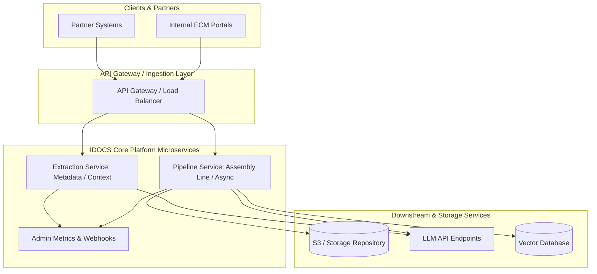
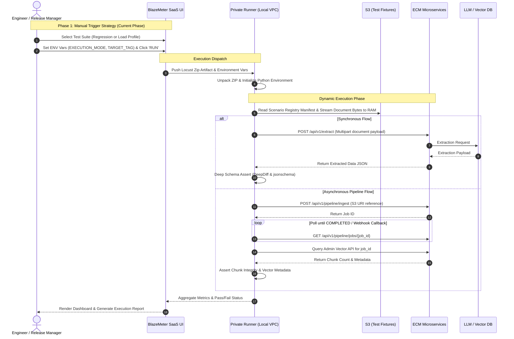

# Enterprise IDOCS/ECM Automation Platform: Architectural Blueprint & Governance Standard

System Scope: Enterprise Content Management (ECM) & Intelligent Document System (IDOCS) Platform


## Summary & TL;DR
### The Challenge
Our ECM Document Extraction Platform handles multi-hop operations across 200–300+ partner scenarios, diverse document types (PDFs, Excel, HTML, Word), synchronous metadata extraction, asynchronous S3 parsing pipelines, and Vector DB embedding for RAG/Agent workflows.

Traditional testing setups fail here because they do not easily support deep JSON schema diffing, dynamic S3 binary ingestion, stateful async polling, or LLM-as-a-Judge semantic assertions.

### The Solution
We are establishing a Code-First, Data-Decoupled Test-as-a-Service Platform using Python (Locust) orchestrated through BlazeMeter SaaS (Private Location Runners).

```ascii
       [ Git Repository ]                  [ Cloud S3 Storage ]
(Locust Code + JSON Manifests)        (200-300+ Test Document Binaries)
              │                                      │
              └───────────────────┬──────────────────┘
                                  ▼
                     [ BlazeMeter SaaS UI ]
              (Manual Launch or CI/CD Webhook Trigger)
                                  │
                                  ▼
                   [ Local Runner (VPC/K8s) ]
                     (Executes Python Locust)
                                  │
           ┌──────────────────────┼──────────────────────┐
           ▼                      ▼                      ▼
  [ Sync Extraction ]   [ Async S3 Pipeline ]   [ Vector / LLM API ]
```

## Key Takeaways for Leadership & Engineers
* Single Artifact Strategy: The exact same Python test artifact handles Functional Regression (1-user, strict deep validation) and Load/Stress Testing (N-users, performance metrics) simply by toggling environment variables.

* Manual-First, CI/CD Ready: Executed manually on-demand via BlazeMeter SaaS UI for current UAT/Pre-Prod releases; fully pre-configured for automated execution via Jenkins/GitHub Actions API in future releases.

* Zero-Code Onboarding: Onboarding a new partner or document type requires zero Python code changes. Developers simply upload the file to S3 and add a 10-line JSON manifest entry in Git.

* Zero-Overhead NFR Updates: Framework tests system endpoints black-box style. Operating System updates, Spring Boot version bumps, Tomcat upgrades, or AVIT security patches can be validated instantly without refactoring test suites.

## 1. System Context & Strategic Goals
The ECM Platform ingests unstructured and semi-structured documents, applies custom parsing, invokes LLM services for semantic extraction, and syncs chunks to Vector DBs.


### Strategic Testing Objectives
1. End-to-End Validation: Cover multi-hop document flows from trigger to asynchronous notification callback.

2. Schema & Semantic Rigor: Ensure strict contract compliance for structured outputs while dynamically evaluating LLM phrasing.

3. Execution Efficiency: Prevent binary bloat in Git repos and reduce load-generator container startup latency.

## 2. Platform Architecture & Execution Flow
The test framework operates as a Hub-and-Spoke system. BlazeMeter handles SaaS orchestration and private runner provisioning. Locust reads version-controlled JSON manifests to stream S3 files dynamically into memory.


## 3. Execution Trigger Strategy: Manual-First to CI/CD
To support immediate operational needs without imposing rigid engineering prerequisites, execution is decoupled into two phases:

### Phase 1: Manual On-Demand Trigger (Current State)
Engineers manage releases directly through the BlazeMeter SaaS UI targeting on-premise Private Location Runners inside the corporate VPC.

1. Package Artifact: Run the automated build script locally or fetch from Git releases (locust_suite.zip).

2. Upload to BlazeMeter: Upload the .zip archive once into BlazeMeter Performance Suite.

3. Configure Environment Parameters:

* Set EXECUTION_MODE = REGRESSION or LOAD.

* Set TARGET_TAG = smoke, partner_alpha, or all.

3. Execute: Click Run Test. The private runner pulls the payload, streams test files from S3, executes assertions, and publishes metrics to the SaaS console.

### Phase 2: CI/CD Pipeline Trigger (Future State)
When the team transitions to automated pipeline deployments (Jenkins, GitHub Actions, or Harness), the test harness requires zero script changes.

## 4. Test Data Management & Manifest Specifications
To prevent repository bloat and speed up execution, test logic is separated from test data. Binary files live in S3, while validation contracts live in a version-controlled manifest file (config/scenarios.json).

### Manifest File Structure (config/scenarios.json)
```json
[
  {
    "scenario_id": "PARTNER_ALPHA_PDF_SYNC_01",
    "partner_id": "partner-alpha",
    "mime_type": "application/pdf",
    "s3_document_key": "raw-documents/partner-alpha/pdf/complex_invoice.pdf",
    "flow_type": "SYNC_METADATA_EXTRACTION",
    "expected_schema": "schemas/invoice_schema_v2.json",
    "semantic_rules": [
      {
        "json_path": "invoice_metadata.invoice_number",
        "matcher": "REGEX",
        "pattern": "^INV-\\d{5}$"
      },
      {
        "json_path": "financials.total_amount",
        "matcher": "TYPE",
        "expected_type": "float"
      }
    ],
    "tags": ["smoke", "regression", "high_volume"]
  },
  {
    "scenario_id": "PARTNER_BETA_EXCEL_VECTOR_02",
    "partner_id": "partner-beta",
    "mime_type": "application/vnd.openxmlformats-officedocument.spreadsheetml.sheet",
    "s3_document_key": "raw-documents/partner-beta/excel/financial_statements.xlsx",
    "flow_type": "ASYNC_S3_VECTOR_PIPELINE",
    "chunking_strategy": "SEMANTIC_V2",
    "expected_chunks_range": [12, 18],
    "tags": ["regression", "vector_pipeline"]
  }
]
```
## 5. Technology Stack & Architectural Justifications
| Layer	| Recommended Tech | Architectural Rationale & Advantages |
| ----- | ---------------- | ------------------------------------ |
| Test Runner Engine | Python (Locust) | Code-First Agility: Expresses multi-hop async workflows, polling loops, and complex assertions natively in Python. Dual Purpose: Same script drives 1-user functional runs and 10,000-user stress runs cleanly.|
| Orchestrator | BlazeMeter SaaS (Private Runners) | Zero Infra Overhead: Manages execution schedules, dashboards, and reporting centrally while running test agents securely inside our private VPC. |
| Data Repository | S3 Storage |	Lightweight Codebase: Decouples large PDF/Excel/HTML files from Git. Assets are fetched dynamically directly into runner memory on demand. |
| Structural Validation	| jsonschema & DeepDiff	| Strict Schema Assurance: Validates multi-nested extraction payloads against defined contracts while ignoring dynamic noise like timestamps.|
| LLM Semantic Eval	| DeepEval / Promptfoo | Non-Deterministic Evaluation: Provides LLM-as-a-Judge semantic scoring, hallucination tracking, and tool-call tracing for Agentic workflows.|

## 6. Scalability, Maintainability & Zero-Overhead Governance
## 6.1 Zero-Code Scenario Onboarding
1. Adding support for a new partner or new document format does not require modifying Python test scripts:

2. Upload Document: Place the new document (partner_gamma_contract.docx) into the S3 fixture bucket.

3. Add Manifest Entry: Append a new JSON block to config/scenarios.json defining the validation contract.

4. Commit & Run: The next execution automatically picks up and runs the scenario.

## 6.2 Zero-Overhead Handling for Infrastructure NFRs
Because the platform acts as a black-box test harness against public/internal service APIs:

  * Framework Upgrades (Spring Boot / Tomcat): Upgrade microservice dependency versions in UAT and execute the Functional Regression profile. If JSON contracts pass, backward compatibility is guaranteed.

  * Security & Vulnerability Patching (AVIT / OS Patches): Apply patches to UAT infrastructure and trigger the Load Profile. If throughput, p99 latency, and CPU/memory utilization remain within thresholds, the patch is approved for production deployment.

## 7. Reporting & Executive Dashboards
Visibility is partitioned according to audience needs:

```ascii
                               ┌──────────────────────────────────────────┐
                               │           Test Execution Engine          │
                               └────────────────────┬─────────────────────┘
                                                    │
                        ┌───────────────────────────┴───────────────────────────┐
                        ▼                                                       ▼
        ┌───────────────────────────────┐                       ┌───────────────────────────────┐
        │   BlazeMeter SaaS Dashboard   │                       │   Allure Matrix Dashboard     │
        │   (Performance & Latency)     │                       │   (Functional Quality Matrix) │
        └───────────────┬───────────────┘                       └───────────────┬───────────────┘
                        │                                                       │
                        ▼                                                       ▼
        ┌───────────────────────────────┐                       ┌───────────────────────────────┐
        │ Target: Architects & SREs     │                       │ Target: Dev Lead & Partners   │
        │ - p95/p99 Latency Metrics     │                       │ - Partner vs Scenario Matrix  │
        │ - Throughput (RPS) & Errors   │                       │ - Schema Validation Failures  │
        └───────────────────────────────┘                       └───────────────────────────────┘
```
1. Architects & SREs (BlazeMeter Console): Focuses on system health, response time percentiles, concurrency limits, system bottlenecks, and resource utilization.

2. Developers & Engineering Leads (Allure Reports): Displays detailed pass/fail breakdown matrices indexed by partner_id, file format, and explicit schema assertion failures.

3. External Partners: Automated pipeline jobs extract test metadata for a given partner_id to generate SLA compliance certificates (e.g., "100% Schema Accuracy across 15 Contract Schemas").
